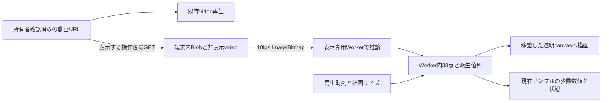

承認依頼

# T12-2 履歴詳細動画への骨格・数値重畳設計案

作成: 2026-10-05。基準: 検収済みT12-0 `3f878a9`、T12-1追記3まで `cb24f76`。設計のみ。製品実装、migration、依存追加、クラウド設定変更は行っていない。

## 1. 推奨と承認事項

**`/history/[sessionId]` の「過去動画」で、明示操作による閲覧時再推論＋Worker内描画を推奨する。生33点はWorker外へ返さず、永続保存しない。** 同一ページ内では再生・seekに再推論せず、完成した10fps列をWorker内で再利用する。ページを閉じる／表示を終了する／backgroundへ移ると破棄する。

初回製品版は骨格と現在時刻の膝平均・腰相対高さに絞る。頭位置・体幹・左右差・足幅・頂点ジャンプ・書き出しは初回に含めない提案。T12-1のJev入力候補の選定とは別の判断とする。

承認を求める点は、(1)閲覧時の明示再処理とWorker内の一時保持、(2)後述の初回表示範囲と状態別の扱い、(3)頂点ジャンプ／動画書き出しの見送り、(4)実機検証を通ってから段階公開するタスク分割。現行T11-2設計の追補として承認後に記録する。本文は実装開始の承認を得たことを意味しない。

## 2. 現行コードとの接点

- [履歴詳細page](<../app/(protected)/history/[sessionId]/page.tsx>)は所有者スコープで履歴を取得し、「過去動画」内のVideoPlaybackに署名URLを渡してnative video controlsで再生している。その下に登録情報、[PoseMeasurementCard](<../app/(protected)/history/[sessionId]/pose-measurement-card.tsx>)、AI分析結果がある。
- [再生URL契約](../lib/uploads/video-playback-url-core.ts)はUPLOADED / READYのみ、15分有効。骨格再表示も同じ所有権境界を使う。URLを知っているだけで任意動画を再処理するサーバAPIは作らない。
- [Worker](../lib/pose/pose-landmarker.worker.ts)は33点を保持して集約し、finishで破棄する。[protocol](../lib/pose/protocol.ts)は進捗と集約だけを返す。[T11-2 §5/6](t11-2-pose-feature-design.md)は生33点非保存と、アップロード前のローカルFile処理を前提としている。
- T12-0は検証専用Workerから生33点を出し、private helperをサーバメモリ上でexportしている。この仕組みを製品へ持ち込まない。承認後は必要な純粋計算・描画を公開モジュールに切り出す。

今回の追加は「S3の既存動画を閲覧時に取得して再処理する経路」であり、T11-2のアップロード時経路とは異なる。非保存・Worker内保持は維持するが、finish即破棄から閲覧中保持へライフサイクルを延長する。既存のアップロード用Workerはそのままの終了動作を維持し、表示用Workerを別エントリにする案。

## 3. 33点の扱いを比較する

| 案 | 表示まで / iPhone負荷 | データ量 | プライバシー・同意 / 設計整合 |
| --- | --- | --- | --- |
| A: 閲覧時再推論、33点をmainへ返して描画 | 取得＋初期化＋全推論。毎回CPU負荷。描画は単純 | 永続追加0、メモリ内33点＋転送コピー | 非保存だがWorker外非公開を変更。描画しやすさだけで境界を緩める理由は弱い |
| **B: 閲覧時再推論、Worker内描画（推奨）** | 同じ推論負荷。完了後は保存した列を描くだけ | 永続追加0、Worker内列＋canvas。mainには現在値のみ | 33点非送信・非保存を維持。閲覧中保持と再処理の明示説明は追加。OffscreenCanvas描画の実機確認が必要 |
| C: 33点を永続保存 | 新規計測時に生成すれば再表示は取得・描画だけ。古い履歴は再処理が必要 | 20秒でpacked両座標約258KiB＋meta、JSONは増える | 詳細な運動軌跡を新規保存。目的・保存期間・削除・同意・所有者制御・version管理を追加。T11-2の主要前提変更 |
| D: 間引き／量子化して保存 | 再表示は軽い。生成時の推論負荷は残る | 例: 5fps・2D x/y uint16のみ約12.9KiB＋mask等 | 小さくても身体軌跡の保存であり匿名化ではない。最大保持差約0.2秒、角度や数値の再現性低下。品質・丸め仕様の検証が必要 |

容量は圧縮前の概算。20秒×10fps=200frame、33点×5成分(x,y,z,visibility,presence)×float32 4byte×normalized/worldの2組=264,000byte（約258KiB）。timestamp等は別。JS object・配列・WASM・動画decoderのメモリはこの数倍以上になり得るため、この値をブラウザ総使用量としない。Dは100frame×33×2×2=13,200byteで、3D膝を再計算できず別の派生値も必要。保存案でも原動画の通信量は減らない。

既知のiPhone C1は89frameで約8.2秒（初期化約2.375秒）。単純な線形概算は200frameで18.4秒、初期化を分けると約15.5秒であり、**閲覧時の実測ではない**。S3取得、動画サイズ、描画、熱、メモリ圧迫でさらに遅くなる。[T11-7a診断記録](t11-7a-ios-pose-diagnosis.md)と既存agmsg実測が基準。上限動画は[100MiB](../lib/uploads/video-constraints.ts)で、骨格列よりBlobとdecoderが支配的になり得る。

Bを選ぶ理由は、利用価値を試す段階で身体軌跡の永続保存・同意・削除経路を増やさずに済むため。待ち時間を隠さず任意機能とする。待ち時間が実機で許容されなければ、C/Dの保存を別承認に戻す。非対応端末でAへ無断fallbackしない。

## 4. 推奨方式のデータとライフサイクル

### 取得とiPhoneの開始制約

初回「骨格と数値を表示」押下で署名URLからCORS fetchしてBlob化する案。既存再生videoをseekで動かさず、別の非表示videoを用いる。通常再生は取得中も使える。Blobを既存フレーム取得経路へ渡し、model/WASMを遅延ロードする。動画・骨格の新規アップロードは行わない。

重要な未検証点は**再生可能なS3 URLでもCORS fetchやピクセル取得が可能とは限らない**こと。現在の実環境CORS値は未確認。許可originのGET、必要なheader、Range再生、署名失効を実装前のspikeで確認する。`no-cors`のopaque応答で回避しない。失敗時は通常動画だけを継続し、server proxyを無断追加しない。[CanvasとCORS](https://developer.mozilla.org/en-US/docs/Web/HTML/How_to/CORS_enabled_image)

Blob取得のawait後にplayを呼ぶと、T11-7で確認したiPhoneの同期user activation条件を失う可能性がある。第一案は二段階: 取得完了後に「計測を開始」を出し、その押下handler内で、最初のawait前に既存A1のplay primingを呼ぶ。1クリック化は実機で安全に成立する場合のみ別判断。自動再試行・backgroundでの自動開始はしない。

15分失効や取得失敗は「動画を再読み込みして試す」で終了し、再読込で既存の所有者確認を経て再署名する。新しい再署名APIは初回不要。動画削除／権限喪失後の再読込ではnotFoundまたは通常の取得不能表示。署名URL・動画body・座標をログに記録しない。

### Worker境界と描画

表示用Worker内で固定10fpsの全処理を完了し、33点と必要派生値を保持する。model instanceは完了後closeし、列だけで再生する（WASMメモリが全て即解放されるとは保証しない）。main→Workerはinitialize/detect/finalize、描画canvasのattach、time/size/clear、dispose。Worker→mainはprogress、quality、現在サンプルの数値・sampleTimestamp・missing理由だけ。全時系列・点列・顔画像は返さない。

HTML canvasを `transferControlToOffscreen()` で移譲し、video上の透明レイヤとしてWorkerで描画する。MediaPipe用のOffscreenCanvasとは分ける。移譲は一度なので再初期化時にcanvas要素を作り直す。これは標準APIで可能だが、C1で検証した推論用canvasと表示用2D canvas移譲は別の互換性項目。[API資料](https://developer.mozilla.org/en-US/docs/Web/API/HTMLCanvasElement/transferControlToOffscreen)

描画はobject-containの実映像矩形へ合わせ、黒帯に点を置かない。元の向き、videoWidth/Height、resize、縦横切替、devicePixelRatioを考慮する。canvasの最大pixel数を制限する案（例: DPR最大2、総4MP以内）は実機で調整。4MP RGBAだけでも約16MBなので無制限に拡大しない。

`requestVideoFrameCallback`のmediaTimeを使い、無い端末は再生中のRAF/currentTimeとseekedで更新する案。直前10fpsサンプルを最大0.1秒未満保持し、欠損frameや最終範囲外で古い骨格を延長しない。未来の補間骨格は作らない。requestの世代番号を付け、seek前の遅い応答・別動画の応答を破棄する。pending描画は最大1件＋最新要求にまとめる。時刻移動中は旧描画を隠し、対応完了後に戻す。

低信頼度点は赤い正確な位置として描かず、初回製品ではその点と接続線を省略し「一部を検出できません」を表示する。画面外点も省略する。T12-0の赤表示は診断専用のまま。1点ごとの数値表示も既存の必要部位gateを守る。

### 終了と通常機能の独立性

状態はOFF → FETCHING → READY_TO_START → MEASURING → READY / PARTIAL / ERROR。取得と推論にそれぞれ120秒のabsolute timeout案、進捗ごとに延長しない。キャンセルはAbortController、Worker terminate、bitmap close、Blob URL revoke、非表示video source除去、canvas消去まで行う。route離脱、logout、表示を終了、pagehide/visibility hiddenでも同じ破棄を行い、復帰後は手動で再開する。bfcache復帰で古い骨格を復活させない。

同一ページでのseek／再生はREADYの列を使う。「骨格を隠す」は軽い表示切替として列を保持し、「表示を終了」は破棄として区別する案。通常の再読込や再訪時は再処理。IndexedDB、localStorage、Cache API、DB、S3へ列を保存しない。ブラウザ自体の動画HTTP cacheまで非保存と保証する説明は避ける。

overlay失敗はvideo playback、AI分析閲覧・再分析、保存済みフォームカードを失敗にしない。未対応、model取得失敗、CORS失敗、timeout、低検出のどの場合も通常動画を残す。UIから計測保存APIを呼ばず、既存履歴の計測値を上書きしない。

## 5. 結果画面と数値

「過去動画」内の既存プレーヤーをClient Componentへ切り出し、videoの上に透明canvas、直下に操作・現在値を置く。native controlsは維持し、canvasはpointer-events:none。骨格を見せるために動画を隠す別canvas再生へ置換しない。

320pxでは動画幅100%、現在値は1列、操作は折り返し、横スクロールを作らない。動画上には骨格と小さな「参考表示」のみ。数字や長い注意書きで足元を覆わない。現在値は動画と一体の下段に置き、重畳表示の一部として扱う。ボタンは44px以上、keyboard操作可能、progressは間引いて通知し、毎frameの数値をaria-liveで読み上げない。

| 初回表示 | 説明 |
| --- | --- |
| 現在サンプルの左右膝平均角 | deg。単一時点であり、保存カードの「最小」（p05）と違う |
| 現在サンプルの腰相対高さ | 胴長比。全体p80基準の相対位置で、保存カードの上下範囲と違う |
| 再生時刻 / 計測時刻 | 間の映像では直前計測を表示することを短く伝える |
| 検出状態 | 取得不能は「—」。失敗スコアや0点にしない |

常設文言案: 「動きの参考表示です。成功・失敗や成績を表す数値ではありません。」補足を開くと「約0.1秒ごとの推定を重ねています。腰の高さは相対値で、跳躍高や接地を実測したものではありません。」を示す。UIにWorker、33点、JSON等の実装用語を出さない。

頭の相対位置はT12-1追記4で定義した研究候補。今回の製品初期値に自動採用しない。将来表示するなら「頭−腰の画面上の横ずれ」等とし、「重心」ラベルを使わない。左右膝差、足首差、足幅、体幹、グラフ、頂点／着地の値も初回対象外。

既存フォーム計測カードは**登録時に保存した集約結果**として残す。動画側は「この端末で今回表示用に計測」と明示し、runtime/model版の違いで値が変わることは補足に記載。保存カードとの比較・成長差分には今回の値を混ぜない。version不明の古い履歴も推測で埋めない。

### 保存状態と今回の表示状態

| 履歴 / 再生状態 | 製品表示案 |
| --- | --- |
| 保存計測COMPLETED | 通常動画＋任意の表示開始。保存済みでも33点は無いので即時重畳とはしない |
| UNASSESSABLE | カードの判定不能を維持。「検出できた部分を見る」を任意提供。今回処理後も全体gate不足ならPARTIALとして骨格のみ、数値は全て—にする案 |
| FAILED / TIMED_OUT / CANCELED | 保存時の説明を維持。動画が再生可能なら今回の表示用再処理は試せる。成功しても保存状態を変更しない |
| 未計測の古い履歴 | カードは未計測のまま。動画に現行制約（形式・長さ等）を適用できるなら任意再処理を提供 |
| 再生不可・未upload・削除 | 表示開始を出さず既存の動画状態説明を使う |
| 今回の推論失敗／非対応 | 通常動画のみ。「この端末では骨格表示を準備できませんでした」。繰り返し自動起動しない |

全体gate通過でも現在サンプルの部位不足なら該当数値は—。全体gate不通過で部分骨格を許すのは、診断的な閲覧だけを追加する提案であり、計測可能と格上げするものではない。数値を出さない方針と合わせて承認を求める。

native動画fullscreen / PiPでは別レイヤが重ならない場合があるため、初回は「全画面では元動画のみ」と説明し、overlayを消す。iPhoneのfullscreenを含む挙動を検証する。容器ごとの独自fullscreenや複合動画化は別タスク。

## 6. 頂点誤検出への対応

[T12-1 §5](t12-1-typesafe-jev-research.md)でkickflip_5は踏み切り前4.9秒を選び、kickflip_4は下降側8.2秒の疑いがある。後者は全体品質gate通過。したがって80%gateだけで頂点の正しさを保証できず、近傍中央値も局面選択の誤りを修正しない。

初回製品に**「推定頂点へジャンプ」は入れない**。自動頂点の目印や、その瞬間が最良の姿勢であるかのようなカードも出さない。利用者は再生・一時停止・±0.1秒移動で見たい時点を選ぶ。現在値にも推定の誤りは残るので、低信頼部位を省略し、原動画を主として比較できる切替を用意する。

将来追加するなら、頂点付近の連続欠損、候補範囲端、単発ジャンプ、画面外点の扱いを定義し、別の未使用動画で目視時刻との誤差を評価する。検出不能時のボタン非表示を含めて承認を得る。ユーザー指定時刻を使う案も自動頂点とは別に表示・保存の有無を設計する。

## 7. 書き出しは初回に含めない

目的は履歴詳細での見返し。T12-0のMediaRecorderはリアルタイム録画で、コマ落ち・尺差があり、今回確認はWebM/VP9・音声なし。iPhoneの保存・共有先で読めるMP4、音声同期、codec/mux、背景移動、失敗時の復旧まで製品品質にするには別検証が必要。[T12-0制約](t12-0-pose-viewer.md)

初回はダウンロード／共有ボタンを追加しない。将来書き出すなら身体軌跡と数値の外部持出しが増えるため、出力形式、説明表示、保存先、音声、端末負荷、同意と削除可能範囲を別設計にする。検証用WebMをそのまま本番機能としない。

## 8. 実装タスク案と完了条件（承認後）

| ID | 内容 | 完了条件 |
| --- | --- | --- |
| T12-2a | 実動画取得・表示用canvasの技術検証 | owner署名S3 URLをCORS fetch→Blob→A1で処理。iPhone Chrome/Safariで2段階操作、canvas移譲、MP4/MOV成功。未対応時通常再生を維持。CORS変更が必要なら具体差分を別承認 |
| T12-2b | 表示専用Workerと公開helper | 既存アップロード経路はfinish破棄のまま。表示用だけ列保持・描画・現在値を返す。protocolに生点列が無いことをテスト。計測値の同一入力整合、欠損／画面外省略、terminateを確認 |
| T12-2c | 履歴プレーヤーとレスポンシブUI | 320px、縦横切替、黒帯、再生速度、seek、±0.1秒、native controls、keyboard操作、fullscreen/PiPでの通常動画fallbackが成立。保存カードと今回値を混同しない |
| T12-2d | 状態・所有権・終了処理 | 上表全状態を確認。401/403・URL失効・動画削除・キャンセル・timeout・background/bfcacheで古い描画なし。座標保存API・外部送信が無いことをネットワーク検証。AI閲覧/再分析と削除操作が継続可能 |
| T12-2e | 実機負荷・品質・公開判定 | 6本＋20秒/100MiB上限に近いfixture、iPhone Safari/Chrome・Android Chromeで取得/初期化/推論/描画時間、メモリ可能範囲、発熱、連続3回と資源解放を記録。kickflip_4/5を頂点誘導しないことを目視。flagで限定公開→通常再生へ即rollback可能 |

負荷の暫定受入案: 既知89frame動画の取得を除く表示準備15秒以内、20秒動画は30秒以内を目標にし、実測8.2秒に対する悪化を説明できること。全計測timeout120秒は待ち時間の合格基準ではない。取得時間はネットワーク別に分ける。通常再生・キャンセル操作が固まらず、10fpsの保持と処理遅延を分離して報告できること。3回の終了後にWorker/Blob URL/bitmap/列が残らないことを確認する。メモリの絶対値上限は実測なしに保証せず、実機tab再読込・クラッシュが出れば公開しない。

各段階で変更に対応した単体・ブラウザ統合・実機確認を行う。T11-5の「骨格がどの終了状態でもS3/LLMが進む」既存テストを回帰確認し、製品ビルドと型検査を通す。今回の設計タスクではこれらの実装・テストは未実施。

## 9. 未確認事項と検収対象

S3 CORSの実値、表示用OffscreenCanvasのiPhone互換性、100MiB Blobと二つのvideoによるメモリ負荷、fullscreen、保存計測と今回計測の差は実装前検証項目。待ち時間・消費電力の値は試算であり保証ではない。

本書の検収対象は方式B、画面・数値範囲、状態別の部分骨格表示、頂点ジャンプ／書き出し見送り、実装分割。Jevの実験条件や頭位置の表示追加はT12-1側の判断に残し、この設計を通じて自動的に承認された扱いにしない。
